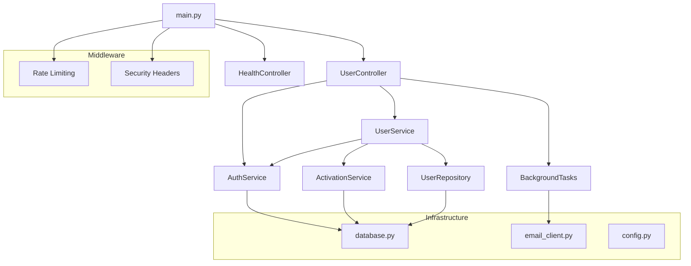

# App Architecture

## Overview

Standard layered architecture with FastAPI. Controllers handle HTTP, services contain business logic, repositories manage data access.

```
HTTP → Controllers → Services → Repositories → Database
```

## Component Relationships



## Components

### Controllers
- `UserController` - registration and activation endpoints
- `HealthController` - health check

### Services  
- `AuthService` - password hashing, user authentication
- `UserService` - registration workflow
- `ActivationService` - code generation and verification

### Repository
- `UserRepository` - user data operations

### Infrastructure
- `database.py` - connection pooling
- `config.py` - environment settings
- `email_client.py` - HTTP client for mailer service
